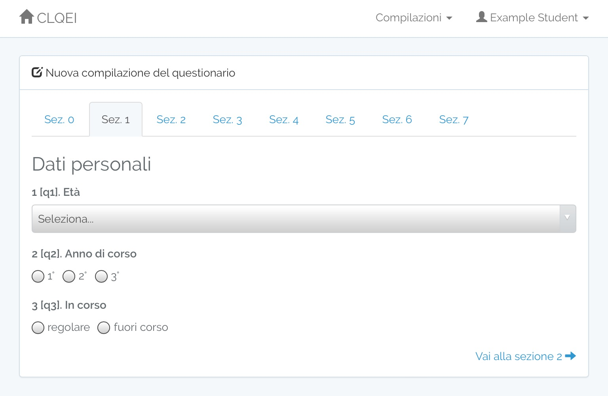
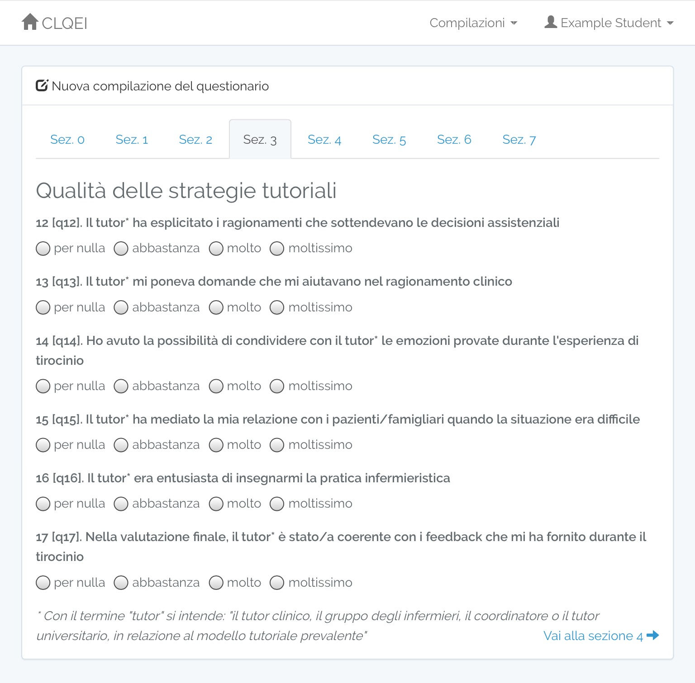

#### Questionnaire screenshots

Section 0: stage identification 

Section 1: personal data 

Section 2: stage information 

Section 3: quality of the tutorial strategies 

Section 4: learning opportunities 

Section 5: safety and nursing care quality 

Section 6: self-direct learning 

Section 7: quality of the learning environment 
